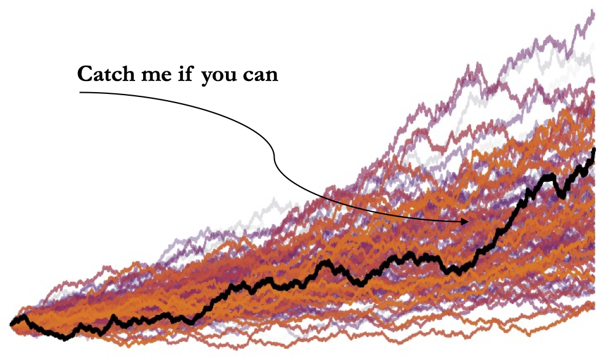

# Portfolio Optimization (A Data-Centric Approach with Distributional Robustness)

Author: Andreas Engly
Date: 15-01-2024

This repository will hold the implementations and data sources related to my master thesis in "MSc. in Mathematical Modelling and Computation" at Technical University of Denmark (DTU). 

## 1. Construction of Dataset for Prices of S&P 500 Constituents

Source [1]: https://en.wikipedia.org/wiki/List_of_S%26P_500_companies

Source [2]: https://home.treasury.gov/resource-center/data-chart-center/interest-rates/TextView?type=daily_treasury_yield_curve&field_tdr_date_value_month=202401

Relevant files: DATASET_Construction.py and DATASET_Combine.py

In the thesis, I construct a dataset consisting of historical prices for S&P 500 constituents throughout the last 24 years (starting from 01/11-1999).
As these are not publically available, I scrape Source [1] for current constituents and changes made back in time. Then I continuously update the constituents to construct the dataset "ConstituentInformation.csv", where all constituents on all trading days are listed. 

To include an asset resembling a bank account, I use 3M short-rate obtained for Source [2]. 

The total set of tickers are found as the union of all days in "ConstituentInformation.csv", and then the prices are downloaded with AlphaVantage. It requires a premium API key, which can be obtained from their website. If you wish to use the code, change the ticker in EITP/DataHandlers/DataFetcher.py, which is used in the code. The package EITP includes essential functions used in the code in general.

Disadvantage: Some tickers cannot be obtained. In addition, to backtest I need to make a intersection of assets over a fixex periods excluding backrupcies, delistings and so forth. Prone to survivorship bias.
Advantage: Cheap to construct.

## 2. Construction of Models

1. Risk-Adjusted Excess Return Model (RAERM)

Goal is to obtain best possible return above SP&500. It is a biobjective linear program weighting expected excess returns above S&P 500 and conditional value-at-risk (CVaR) relative to S&P 500. See implementations in EITP/Models/RAERMDRO.py and EITP/Models/RAERMSAA.py.

2. Index Tracking Model (ITM)

This model attemps to track the index and fixed targets above it. It is based on the mean absolute deviation (MAD) and CVaR of MAD.
See implementations in EITP/Models/ITMDRO.py and EITP/Models/ITMSAA.py.

## 3. Experiment of Wasserstein-Based Distributionally Robust Counterparts (W-DRC)

In this part, I compare sample average approximation (SAA) and a Wasserstein-based distributionally robust counterpart (W-DRC). 
The first experiments investigate how portfolio weights and out-of-sample performance is affected. It also looks at how Wasserstein radii can be selected with hold-out. 

Files: EXPERIMENT_Analysis_ExcessCVaR.py and EXPERIMENT_Analysis_TrackingCVaR.py
Output files are saved to: Results/Chapter4_TrackingCVaR and Results/Chapter5_ExcessCVaR

Details of used parameters can be found in the above directories ExperimentLog.txt.

Plots on the basis of the results are saved in ResultsPlots/Chapter4_TrackingCVaR and ResultsPlots/Chapter5_ExcessCVaR. These are generated with ITM (Visualization of Experiments).ipynb and RAERM (Visualization of Experiments).ipynb.

## 4. Backtest of W-DRC RAERM and W-DRC ITM

In this part, I compare sample average approximation (SAA) and a Wasserstein-based distributionally robust counterpart (W-DRC) in a regular backtest. 
The Wasserstein radii is selected with a hold-out method, and the results performance is compared over the entire period. In addition, an efficient frontier is generated for RAERM. 

Files: EXPERIMENT_Backtest_Dynamic_RAERM.py, EXPERIMENT_Backtest_Dynamic_ITM.py, EXPERIMENT_Backtest_Frontier_RAERM.py, and EXPERIMENT_Backtest_Frontier_ITM.py

Output files are saved to: Results/Backtest

Details of used parameters can be found in the above directories ExperimentLog.txt.

Plots on the basis of the results are saved in ResultsPlots/Backtest. These are generated with ITM (Visualization of Backtest).ipynb and RAERM (Visualization of Backtest).ipynb.

## 5. Plots used for Background Theory

In the thesis, I have a comprehensive overview of the utilized theory. Files starting with "Plots of ... .ipynb" holds to code to generate these.
